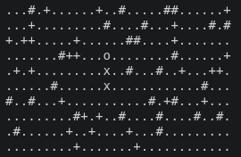

# Snake Game

## Intro
I tried to build the old snake game with cpp as a console app as an ITI cs50 graduation project

## Limitations
The game is blocked until the user enters a key which is a big limitation and solving it will go beyond the course contents


## How To Play



### Game Symbols
- `#` is obstacle
- `+` is food
- `.` is empty cell
- `x` is snake body node
- `o` is snake head node


### How to play
- Use the `WASD` keys for directions
- Use `Q` to quit
- Use `P` to Pause


## How To Run

### Build The Binary
```bash
g++ program.cpp snake-game/src/*.cpp -I snake-game/include -o program

```

### Run It!
```bash
./program
```